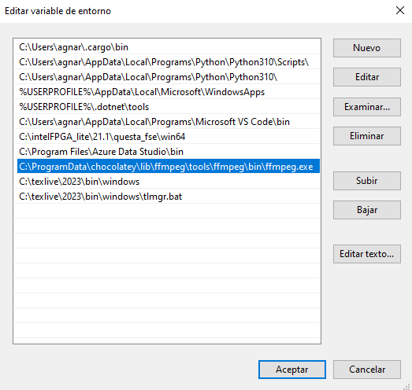

# Videos educativos de combinatoria utilizando Manim

Este repositorio contiene el código fuente utilizado para generar videos educativos sobre combinatoria empleando la herramienta Manim. Los videos fueron desarrollados como parte de un proyecto de tesis con el objetivo de ilustrar conceptos clave de combinatoria de manera visual, interactiva y accesible. Además, este proyecto busca proporcionar documentación clara que facilite a otros usuarios el aprovechamiento de Manim en la creación de contenido educativo.

Durante la creación del código, se aprovecharon diversas funcionalidades de Manim de manera variada. Estos distintos casos de uso de Manim son los que se busca documentar en este código.  El desarrollo sigue las convenciones de PEP 8 y los principios del libro Clean Code, lo que facilita que el código se pueda entender, mantener y reutilizar.

## Proposito
El propósito de este repositorio es proporcionar código bien documentado que utiliza la librería Manim para crear animaciones educativas sobre temas de combinatoria. A través de las diferentes escenas, se muestran casos de uso de las diversas funciones y herramientas que ofrece Manim, con el objetivo de inspirar a otros a explorar sus capacidades y aplicarlas en distintas áreas, más allá de las matemáticas.

Este repositorio no tiene como fin enseñar programación en Python ni profundizar en la funcionalidad específica de Manim. En cambio, busca ofrecer ejemplos prácticos de cómo se puede utilizar la librería para crear animaciones educativas, esperando motivar a otros a experimentarla en sus propios proyectos.
   
## Estructura del Proyecto

Este proyecto incluye cuatro archivos principales, cada uno correspondiente al código que genera las escenas para los videos educativos creados sobre combinatoria. A continuación, se listan los videos y sus enlaces a YouTube:
* Video1-PrincipioMultiplicacionYSuma [link video en YouTube](https://youtu.be/ePPxuT6K6Cg?si=6eOuTOtu87mKtMPv).
* Video2-Permutaciones [link video en YouTube](https://youtu.be/oKf17k7p4GM?si=P4w1DrE1km2NYksn).
* Video3-Combinaciones [link video en YouTube](https://youtu.be/DA367kQNuNk?si=XzI9QgGHI2b4ZcNS).
* Video4-TeoremaDelBinomio [link video en YouTube](https://youtu.be/7FfBGBBckDk?si=H_vxqvjx3WhKTDtO).

La estructura de los archivos es consistente para cada video:
```
<Video-titulo>
├── <nombre-video>.ipynb
├── imagenes
├── utiles
└── media
      ├── images
      ├── jupyter
      ├── Tex
      └── videos
```
* **```<nombre-video>.ipynb```**: contiene el código principal de las escenas utilizadas en el video, detallando cada parte de la animación.
* **imagenes**: carpeta que almacena todas las imágenes en formato SVG utilizadas en las animaciones.
* **utiles**: contiene funciones auxiliares que facilitan el desarrollo de las escenas y la animación..
* **media**: este directorio es automáticamente creado y contiene imágenes, videos y otros archivos generados por Manim y Jupyter.
  * **imagenes**: folder con imagenes generadas con Manim.
  * **jupyter**: contiene el caché de los videos generados desde el Jupyter Notebook.
  * **Tex**: archivos necesarios para manejar objetos LaTeX dentro de las animaciones.
  * **videos**: carpeta donde se almacenan los videos finales generados con Manim.

### Jupyter Notebook
Cada archivo ```<nombre-video>.ipynb``` es un Jupyter Notebook que contiene todas las escenas que conforman un video, organizadas en distintas celdas. La primera celda incluye las importaciones y definiciones necesarias para ejecutar el resto del código. A continuación, cada celda contiene una clase de Python que representa una escena, con su método ```construct``` encargado de generar la animación. Al ejecutar cada una de estas celdas, se genera el video de la escena correspondiente, que se exporta automáticamente en formato MP4. 

El código esta escrito en Jupyter para poder tener las escena de manera más modular y acceder al video resultante de manera rápida. Incluso sin tener Manim y las dependencias necesarias al descargar el repositorio se descargan los videos correspondientes a cada escena dentro del Notebook. Por lo que, se puede relacionar fácilmente cada video con su código correspondiente.

## Recomendaciones antes de entrar al código
1. **Visualiza el video correspondiente**: Antes de intentar comprender el código, te recomendamos ver el video asociado a cada escena. Si no tienes las herramientas necesarias para ejecutar el código, puedes acceder a los videos ya generados, ubicados en las carpetas creadas por Manim y Jupyter (descritas en la siguiente sección). Esto te ayudará a relacionar mejor el código con la animación visual.

2. **Consulta la documentación de Manim**: Cuando encuentres una función predeterminada de Manim por primera vez, realiza una búsqueda en la documentación oficial para entender su funcionamiento y cómo se utiliza en el contexto del proyecto.

3. **Experimenta con el código**: Haz modificaciones en el código y observa los efectos que tienen en las animaciones. Esta práctica es excelente para aprender y comprender cómo pequeños cambios pueden alterar la visualización de las escenas.

## Requisitos previos
* Python 3.8+
* Manim para Jupyter Notebooks
* Dependencias de Latex para Manim
* Un visor de videos como VLC o cualquier otro reproductor compatible con ```.mp4```
  
## Instalacion de Manim para Jupyter con Conda

### Paso 1: Instalar Anaconda 3
Para comenzar, debes instalar Anaconda 3, que es una distribución de Python. Puedes descargarlo desde el sitio web oficial de Anaconda: [Anaconda Install](https://docs.anaconda.com/free/anaconda/install/index.html).

### Paso 2: Instalar Jupyter Notebook utilizando Anaconda
Abre Anaconda 3 y haz clic en el botón de "Instalar" que se encuentra en el bloque de Jupyter Notebook.


### Paso 3: Instalar Manim

#### Instalar Chocolatey
Abre una terminal y ejecuta el siguiente comando para instalar Chocolatey:

```bash
Set-ExecutionPolicy Bypass -Scope Process -Force; [System.Net.ServicePointManager]::SecurityProtocol = 
[System.Net.ServicePointManager]::SecurityProtocol -bor 3072; 
iex ((New-Object System.Net.WebClient).DownloadString
('https://chocolatey.org/install.ps1'))
```

#### Instalar dependencias
Ejecuta los siguientes comandos en la terminal para instalar las dependencias necesarias:

```
choco install -y ffmpeg
cmd
```

#### Agregar ubicaciones al PATH
Para agregar las ubicaciones de `ffmpeg` y `miktex` a la variable `PATH`, sigue estos pasos:

1. En la ventana "Propiedades del Sistema", haz clic en el botón "Variables de entorno" en la pestaña "Opciones avanzadas".

    

2. En la sección "Variables de sistema", busca la variable llamada `PATH` y selecciónala. Haz clic en "Editar".

    

3. En la ventana "Editar variable de sistema", haz clic en "Nueva" y agrega la ubicación de la carpeta de `ffmpeg`.

    

4. En la ventana "Editar variable de sistema", haz clic en "Nueva" y agrega la ubicación de la carpeta de `miktex`.

5. Guarda tus cambios y cierra todas las ventanas.

6. Ejecuta los siguientes comandos en la terminal:

```
tlmgr --version
tlmgr install standalone
tlmgr install preview
```

7. Abre Jupyter Notebook y crea un nuevo archivo de Python en Jupyter Notebook.

    

8. Ejecuta el siguiente comando en la terminal:

```
!pip install manim
```

    
